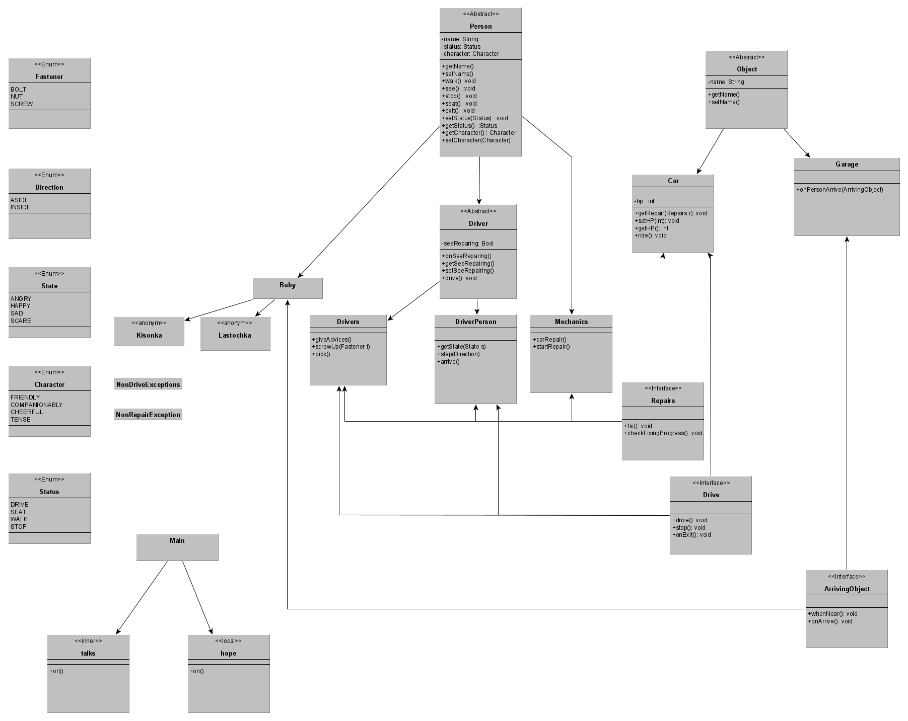

Лабораторная работа №4
---
Никулин Арсений R3136

Вариант: 85323.4


Текст:
 ```Разговоров о коварстве Винтика и Шпунтика хватило до самого вечера. Ласточка и Кисонька, казалось, даже были довольны, что они исчезли, и злорадно посмеивались. Когда надежда на возвращение Винтика и Шпунтика совсем пропала, в конце улицы показалась машина. Она с шипением и треском прокатилась по улице. Малышки бросили работу и помчались за ней. Кисонька и Ласточка бежали впереди всех и кричали: Когда малышки подошли к гаражу, то увидели, что, кроме Винтика и Шпунтика, приехал Бублик. Бублик рассердился и отошел в сторону. Но он не уехал. Увидев, что Винтик и Шпунтик начали починять машину, он принялся им помогать. Такой уж компанейский характер у каждого шофера. Если шофер увидит, что кто-нибудь починяет машину, он обязательно подойдет и тоже начнет что-нибудь ковырять, подвинчивать болт или гайку, или просто станет давать советы. Втроем они провозились до поздней ночи, но все-таки не успели починить машину, так как ремонт требовался очень большой.```


Диаграмма uml:
